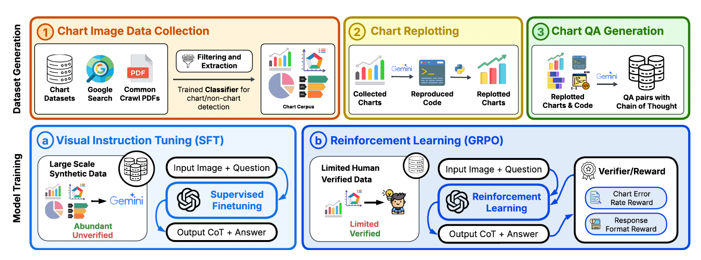
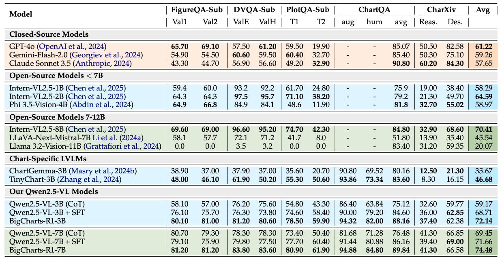

# BigCharts-R1: Enhanced Chart Reasoning with Visual Reinforcement Finetuning

<div align="center">
    
<a href="https://www.arxiv.org/abs/2508.09804" target="_blank">
    
</a>
<a href="https://bigcharts.github.io/" target="_blank">
    
</a>

</a>
<a href="https://openreview.net/forum?id=19fydz1QnW" target="_blank">
    
</a>


</div>


<div align="center">

### Authors

**Ahmed Masry<sup>1,2</sup>**, **Abhay Puri<sup>1</sup>**, **Masoud Hashemi<sup>1</sup>**, **Juan A. Rodriguez<sup>1,3,5</sup>**<br>
**Megh Thakkar<sup>1</sup>**, **Khyati Mahajan<sup>1</sup>**, **Vikas Yadav<sup>1</sup>**, **Sathwik Tejaswi Madhusudhan<sup>1</sup>**, <br>
**Alexandre Piché<sup>1</sup>**, **Dzmitry Bahdanau<sup>1,3,7</sup>**, **Christopher Pal<sup>1,3,6,7</sup>**, **David Vazquez<sup>1</sup>**<br>
**Enamul Hoque<sup>2</sup>**, **Perouz Taslakian<sup>1</sup>**, **Sai Rajeswar<sup>1,3,4</sup>**, **Spandana Gella<sup>1</sup>**

<sup>1</sup> ServiceNow Research, <sup>2</sup> York University, <sup>3</sup> Mila, <sup>4</sup> Université de Montréal  
<sup>5</sup> ÉTS Montréal, <sup>6</sup> Polytechnique Montréal, <sup>7</sup> CIFAR AI Chair  

</div>




## Introduction
Chart comprehension is crucial for effective human decision-making, yet current vision-language models (VLMs) struggle with this task due to limitations in training data and methodologies. To address these challenges, we introduce BigCharts-R1, a state-of-the-art chart reasoning model, alongside a novel dataset and training framework.

* BigCharts Dataset. We propose a novel dataset creation pipeline, BigCharts, which generates visually diverse chart images by replotting real-world charts sourced from various online platforms. Unlike purely synthetic datasets, BigCharts maintains authenticity and visual diversity while ensuring accurate underlying data, overcoming the estimation errors often found in automatically extracted data tables.
* Comprehensive Training Framework:. Our approach integrates supervised fine-tuning (SFT) with Group Relative Policy Optimization (GRPO)-based reinforcement learning. We introduce novel reward signals specifically designed for chart reasoning, which significantly enhances model robustness and generalization across diverse chart styles and domains.
* State-of-the-Art Performance:. Extensive experiments demonstrate that BigCharts-R1 surpasses existing methods on multiple chart question-answering benchmarks, outperforming even larger open-source and closed-source models. This showcases BigCharts-R1's superior capabilities in chart reasoning.


## Results
We evaluate BigCharts-R1 against state-of-the-art open-source and closed-source models across multiple chart question answering benchmarks. Our models demonstrate superior performance, particularly in the 3B and 7B parameter ranges.



### Key Results:
* BigCharts-R1-3B achieves an average score of 72.14% across all benchmarks, outperforming GPT-4o (61.22%) by a significant margin.

* BigCharts-R1-7B reaches 74.48% average performance, demonstrating the effectiveness of our training approach at larger scales.

* Our models show particularly strong performance on chart-specific tasks like ChartQA and CharXiv, highlighting the benefits of our specialized training methodology.

## Setup

```bash
conda create -n bigcharts-r1 python=3.10
conda activate bigcharts-r1
bash setup.sh
```

## 🛠️ Data Generation

Inside the `data_generation_scripts/` folder, you will find three Python scripts that should be run in order:

1. **`charts_to_code.py`**  
   Generates chart code (e.g., Matplotlib) from the input chart images using a VLM model on Open Router.
```python
python charts_to_code.py \
    --images-path "the directory of the original chart images" \
    --target-code-path "the directory to save the code files" \
    --api-key "your open router api key" \
    --model-name "the model name of your choice from openrouter" \
    --num-threads 2
```

2. **`replot_charts.py`**  
   Executes the generated code to replot and render synthetic chart images.

```python
python replot_charts.py \
    --codes-path "the directory of the code files" \
    --target-path "the directory to save the generated images" \
    --num-threads 2
```

3. **`generate_qa_with_cot.py`**  
   Uses a VLM to generate **questions**, **chain-of-thoughts**, and **answers** based on the replotted chart images and corresponding code.

```python
python generate_qa_with_cot.py \
    --images-path "the directory of the chart images" \
    --codes-path "the directory of the code files" \
    --target-path "the directory to save the generated QA with CoT" \
    --api-key "your open router api key" \
    --model-name "the model name of your choice from openrouter" \
    --num-threads 2
```

## Training

### Supervised Finetuning (SFT)
We use [LLaMA-Factory](https://github.com/hiyouga/LLaMA-Factory) to SFT the Qwen-2.5-VL models.

### GRPO
Here are some example steps to train 
1. Download the ChartQA Dataset: Obtain the dataset from the official repository: [ChartQA Dataset](https://github.com/vis-nlp/ChartQA).
2. Reformat JSON Files: Combine and restructure the ChartQA training JSON files ([train_augmented.json](https://github.com/vis-nlp/ChartQA/blob/main/ChartQA%20Dataset/train/train_augmented.json) and [train_human.json](https://github.com/vis-nlp/ChartQA/blob/main/ChartQA%20Dataset/train/train_human.json)) into the following format. This format is required for compatibility with GRPO.
```json
[
  {
    "problem": "the question",
    "solution": "the answer",
    "image": "the image name"
  }
]
```

3. Configure [rl_data.yaml](src/open-r1-multimodal/data_config/rl_data.yaml): Update the json_path in the [rl_data.yaml](src/open-r1-multimodal/data_config/rl_data.yaml) configuration file to point to the location of your reformatted JSON data.

4. Configure [src/open-r1-multimodal/run_grpo_bigcharts_job.sh](src/open-r1-multimodal/run_grpo_bigcharts_job.sh): Modify the dataset_name and image_root variables within the [src/open-r1-multimodal/run_grpo_bigcharts_job.sh](src/open-r1-multimodal/run_grpo_bigcharts_job.sh) script to match your setup. Specifically:

  - dataset_name: Set this to "data_config/rl_data.yaml" (or whatever name you're using for your RL dataset configuration).
  - image_root: Ensure this points to the directory containing your training images.
  - Make sure to update the other relevant parameters in the file (e.g., HF_HOME) as well. 
 
5. Run the following command to start the process:
``bash src/open-r1-multimodal/run_grpo_bigcharts_job.sh``

## 📊 Evaluation

We use dataset-specific evaluation metrics to ensure consistency with prior work:

- **ChartQA** and **PlotQA**:  
  We report **[relaxed accuracy](https://github.com/google-research/pix2struct/blob/67e9f3080850d063c74d65f6336ac86fe817fb04/pix2struct/metrics.py#L81)**.

- **FigureQA** and **DVQA**:  
  We report **exact accuracy**, based on **exact string match** between the predicted and ground truth answers.

- **CharXiv**:  
  We use the official evaluation script provided in the [CharXiv GitHub repository](https://github.com/princeton-nlp/CharXiv).

An example evaluation script is provided for ChartQA, PlotQA, FigureQA, and DVQA in [src/eval/](src/eval)

```python
python eval_bigcharts_r1.py \
    --images-path "test images folder" \
    --data-path "test data json file" \
    --target-path "output json file path" \
    --model-path "your model path" \
    --accuracy-mode "relaxed_accuracy or exact_accuracy depending on the benchmark" \
    --batch-size 4
```

## Acknowledgements
We would like to thank the authors of [VLM-R1](https://github.com/om-ai-lab/VLM-R1) which helped us in the development of the BigCharts-R1 project. 


## Citation
If you use our resources, feel free to cite us: 
```bib
@article{masry2025bigcharts,
  title={BigCharts-R1: Enhanced Chart Reasoning with Visual Reinforcement Finetuning},
  author={Masry, Ahmed and Puri, Abhay and Hashemi, Masoud and Rodriguez, Juan A and Thakkar, Megh and Mahajan, Khyati and Yadav, Vikas and Madhusudhan, Sathwik Tejaswi and Pich{\'e}, Alexandre and Bahdanau, Dzmitry and others},
  journal={arXiv preprint arXiv:2508.09804},
  year={2025}
}
```
